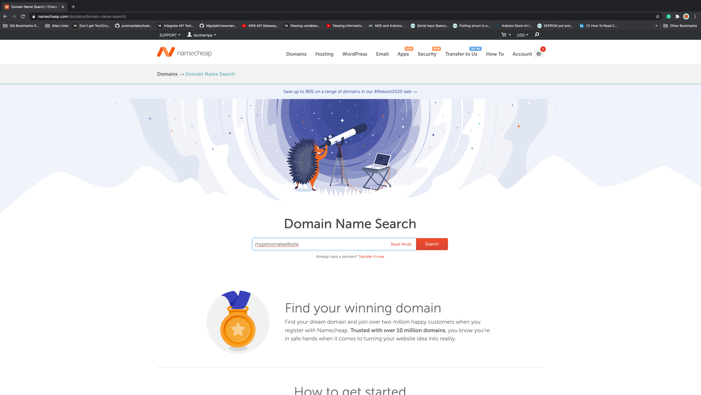

<!-- Add a sentence or two here stating what this is about -->

Ready to earn your Personal Website Portfolio Badge? Follow the steps below and you can be up in running in just 30 mins!


# Buying A Domain:
1. Go to namecheap.com
2. Log-in or Create an account & then log in
3. Hover over the Domains tab at the top and click on Domain Name Search
4. In the search bar, type in the domain name you would like to use for your website (Ideally this would be something like [YourName].com)

 

<a href="./images/namecheap.png" data-lightbox="namecheap.png" data-title="My caption" maxWidth=50%></a>

<script>
    lightbox.option({
      'resizeDuration': 200,
      'wrapAround': true,
      'maxWidth':250
    })
</script>



hello2

5. You will be given a list of options and their respective prices
6. Select the "Add to cart" button next to the domain name you would like to buy
7. When you are ready click on the the Checkout icon at the bottom right
8. Complete the Setup steps
9. Enter your billing information
10. Complete the Order

# Create Your Personal Website:

Start by retrieving our fullstack-portfolio-refresh theme.

1. Go to fullstackproblemsolvers.com and get to the fullstack-portfolio-refresh Github repo
2. Follow the directions in the Readme
3. Go back to your command line and do a:
```
git add -A
```
4. Then do a:
```
git commit -m “Initial commit of personal website for [Insert your website name]”
```
5. Go to Github
6. Create a new repository
7. The repository name should be the same as what you named it on your local computer
8. Leave all the initialization options as default, and Click “create repository”
9. Use the “push an existing repository directions”
10. Now go to Netlify
11. Log-in or create account and then log in
12. New site from Git
13. Click on the Github tab
14. Enter your github login info to connect netlify with your github account
15. Select your new repository you just created
16. For the build command put in hugo
17. For publish directory put in public
18. Click on Advanced
19. In the key put hugo_version
20. In the value put 0.58.3
21. Click on Deploy Site
22. Once the production deploys status changes to Published, move on to the next step
23. Now lets setup your custom domain
24. Click on add a custom domain
25. Type in the domain name you purchased from namecheap
26. Click on verify
27. Click on the options click setup Netlify DNS
28. Click continue
29. Take the IP addresses provide and go back to namecheap
30. Under my account  and click on manage domain
31. Under name servers change to CUstom DNS
32. Add the IP address (provided by Netlify) one by one
33. Then go back to Nelify and click Done
34. Allow 24 hours to complete step 3 of securing your site with  HTTPS

And just like that you now have your personal website!

Now the last step to earning your personal website badge is to complete the Website Inspiration post that you we had you pre-load when you created your website. This post can be as detailed or broad as you want it to be, it just needs to talk about why you created your website. 

Once you complete the final step feel free to _____(NOT SURE WHAT TO PUT HERE????)

Congrats! You have officially earned your Personal Website Badge!

