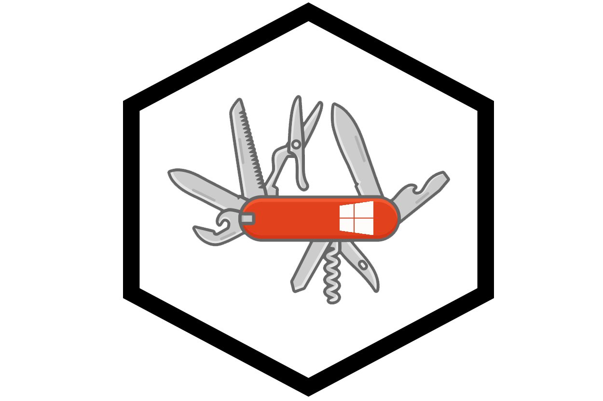

Last Modified: November 2020


# Background: Manage Your Own Portfolio

This is a step by step guide for creating an online portfolio website in less than 1 hour. The steps here provide an online portfolio that is based in open source software.  This means overtime you can expand or change the experience and or port the information over to other systems. 

*Most importantly*, you will gain experience using some open source and technical tools such as:

- **git**  (for version control)
- **markdown** (for content formatting)
- **Hugo**  (static website generator)

Don't worry if you aren't familiar with any of these terms or tools yet. The idea is to get you up and running so you will become familiar with these technologies as you expand your online portfolio. 

Or, if you already know the tools, there is an opportunity for contributions to open source repositories (such as Hugo themes) and/or contributing to documentation (such as this write up).

**Actions To Complete In This Section:** Game on! Just work through each of the sections below. 





# Prerequisites: Setup Your Machine With the Necessary Fullstack Tools

There are some items you will need (and guides to help install, if required)

Technologies installed on your machine:

- **git** and available from the command line
- **Hugo** installed and available from the command line
- **Text Editor** we recommend installing Visual Studio Code (with a spell checker)

**Follow the guide for you operating system below. Then come back to this page once you are setup with the installs:**

    

        
Windows Toolkit Setup:

        <a href=""></a>

    

        

        

        
Mac Toolkit Setup:

        

        <a href=""></a>

    

After the installs are complete sign up for a **Github account** (it's free) if you don't have one.

#### Actions To Complete In This Section: Follow the setup instructions in the linked pages to comfirm your machines has the following fullstack tools: git, Hugo, and a recommended text editor.



## Buying A Domain (on the cheap):

There are many places you can buy a domain, the web address for your website. You can generally find affordable domains and have your own domain is an excellent investment in yourself. Also, you will have the rights of your domain name moving forward as long as you choose to renew your domain name each year.

Log-in, or create account at  [namecheap.com](https://www.namecheap.com/) to search for and buy domain name you would like to use for your website. Ideally this would be something like "yourname.com".

#### Pricing Hints

Domain pricing is a yearly cost that is based on how common the words are in your domain search. More words are more valuable and will be priced higher. With some creativity you can often get the pricing down to $12 *per year* or less.

For example, "howdyitsjenny.com" might be available and inexpensive in cases where  "www.jennysmith.com" is not available or or is priced > $12

Another example: fullstackjimmy" might help you here if  "jimmyandre.com" is already taken or has a high price tag
 





## Step 2: Getting Git Setup

If you don't have a github account you will need one. You can sign up for free at https://github.com/.

Github is the technology platform but you also need to install git, the technology, on your personal machine.

Installing git will differ based on your operating system (Mac, Windows, etc). Below is the link to install git:

https://git-scm.com/book/en/v2/Getting-Started-Installing-Git/

## Step 3: Install Hugo

Hugo is one of the most popular open-source static site generators. As mentioned above there are a million ways and technologies to accomplish creating an online portfolio, this is one recipe. We choose to start with Hugo because some of the benefits it provides are its speed and flexibility. 

Here is a link to install Hugo: https://gohugo.io/getting-started/installing/

## Step 4: Create Your Personal Website

The final step is to actually create the your personal website, follow the detailed step by step directions below.

**Step 1:** Start by retrieving our fullstack-portfolio-refresh theme from https://github.com/Full-Stack-Problem-Solvers/fullstack-portfolio-theme.

**Step 2:** Follow the "Getting Started" directions in the Readme.

**Step 3:** Go back to your command line and do a:


$ sudo bash -c 'echo 0 > /proc/sys/kernel/randomize_va_space'


Then:


git add -A


Followed by:


git commit -m “Initial commit of personal website for [Insert your website name]”


**Step 4:** Return to Github and create a new repository. Making sure to leave all the initialization options as default.

> ###### *NOTE*: The repository name should be the same as what you named it on your local computer

**Step 5:** Follow the “push an existing repository" directions

**Step 6:** Finally go to Netlify to instantly build and deploy your site to their global network. Follow the steps below:

> 
1. Log-in or create account and then log in
2. Click on **New site from Git**
3. Click on the **Github** tab
4. Enter your github login info to connect netlify with your github account
5. Select your new repository you just created in the steps above
6. For the Build Command put in "**hugo**"
7. For Publish Directory put in "**public**"
8. Click on **Advanced**
9. In the Key put "**hugo_version**"
10. In the Value put **0.58.3**
11. Click on **Deploy Site**
12. Once the production deploy status changes to **Published**, move on to the next step
13. Now lets setup your custom domain by clicking on **Add a Custom Domain**
15. Type in the domain name you purchased from namecheap
16. Click on **Verify**
17. Click **Setup Netlify DNS**
18. Click continue
19. Take the IP addresses provided and go back to **Namecheap**
20. Under My Account, click on **Manage Domain**
21. Under Name Servers change to **Custom DNS**
22. Add the IP address (provided by Netlify) one by one
23. Then go back to Nelify and click Done
24. Allow 24 hours to complete step 3 of securing your site with  HTTPS

And just like that you now have your personal website!

Now the last step to earning your personal website badge is to complete the Website Inspiration post that you we had you pre-load when you created your website. This post can be as detailed or broad as you want it to be, it just needs to talk about why you created your website. 

Once you complete that step, Congrats! You have officially earned your Personal Website Badge!