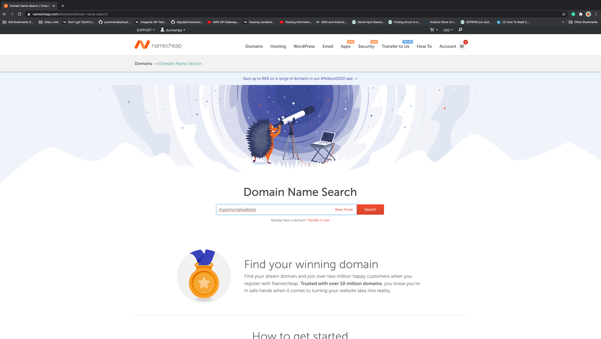

November 2020

# Background

This is a step by step guide for creating an online portfolio website in less than 1 hour. The steps here provide an online portfolio that is based in open source software.  This means overtime you can expand or change the experience and or port the information over to other systems. 

*Most importantly*, you will gain experience using some open source and technical tools such as:

- **git** 
- **markdown**
- **Hugo** 

Don't worry if you aren't familiar with some (or all) of these terms or tools yet. The idea is to get you up and running so you will become familar with these technologies as you expand your online portfolio. Or, if you already know the tools, there is an opportunity for contributions to open source repositories (such as Hugo themes) and/or contributing to documentation (such as this write up).

 
Please note, as of November 2020 these steps were tested on a Mac and should also work without change for Linx based systems. These steps should work for a Windows but if you run into any issues, please raise an issue here. We are looking to include any Windows specific instructions and will credit anyone willing to help. 

# Prerequisites

There are some items you will need. If you dont have these they should be "Google-able":

- **Github account** (it's free)
- **git** and available from the command line
- **Hugo** installed and available from the command line
- **$12/yr** to buy your own domain (it's your to keep)

# Disclaimer:
There are a million ways and technologies to accomplish creating an online portfolio. This is one recipe, that should work to get you up and running within an hour. Another recipe in the works for AWS, but this one is more straightforward if you are not in the AWS ecosystem yet. 


## Step 1: Buying A Domain (on the cheap):

There are many places you can buy a domain. Namecheap has worked well for us to be used for our portfolio. 

1. Go to  [namecheap.com](https://www.namecheap.com/)
2. Log-in, or Create an account to log in
3. In the search bar, type in the domain name you would like to use for your website (Ideally this would be something like [YourName].com)


>>### Some notes on pricing
>> Domain pricing is yearly cost is based on how common the words are in your domain search. More words are more valuable and will be priced higher. With some creativity you can often get the pricing down to $12 or less.

>>#### Some pricing hints

>>For example, "howdyitsjenny,com" might be available and inexpensive in cases where  "www.jennysmith.com" is not available or or is priced > $12

>>Another example: fullstackjimmy" might help you here if  "jimmyandre.com" is already taken or has a high price tag
 


 

<a href="./images/namecheap.png" data-lightbox="namecheap.png" data-title="My caption" maxWidth=50%></a>













hello2

5. You will be given a list of options and their respective prices
6. Select the "Add to cart" button next to the domain name you would like to buy
7. When you are ready click on the the Checkout icon at the bottom right
8. Complete the Setup steps
9. Enter your billing information
10. Complete the Order

# Create Your Personal Website:

Start by retrieving our fullstack-portfolio-refresh theme.

1. Go to fullstackproblemsolvers.com and get to the fullstack-portfolio-refresh Github repo
2. Follow the directions in the Readme
3. Go back to your command line and do a:
```
git add -A
```
4. Then do a:
```
git commit -m “Initial commit of personal website for [Insert your website name]”
```
5. Go to Github
6. Create a new repository
7. The repository name should be the same as what you named it on your local computer
8. Leave all the initialization options as default, and Click “create repository”
9. Use the “push an existing repository directions”
10. Now go to Netlify
11. Log-in or create account and then log in
12. New site from Git
13. Click on the Github tab
14. Enter your github login info to connect netlify with your github account
15. Select your new repository you just created
16. For the build command put in hugo
17. For publish directory put in public
18. Click on Advanced
19. In the key put hugo_version
20. In the value put 0.58.3
21. Click on Deploy Site
22. Once the production deploys status changes to Published, move on to the next step
23. Now lets setup your custom domain
24. Click on add a custom domain
25. Type in the domain name you purchased from namecheap
26. Click on verify
27. Click on the options click setup Netlify DNS
28. Click continue
29. Take the IP addresses provide and go back to namecheap
30. Under my account  and click on manage domain
31. Under name servers change to CUstom DNS
32. Add the IP address (provided by Netlify) one by one
33. Then go back to Nelify and click Done
34. Allow 24 hours to complete step 3 of securing your site with  HTTPS

And just like that you now have your personal website!

Now the last step to earning your personal website badge is to complete the Website Inspiration post that you we had you pre-load when you created your website. This post can be as detailed or broad as you want it to be, it just needs to talk about why you created your website. 

Once you complete the final step feel free to _____(NOT SURE WHAT TO PUT HERE????)

Congrats! You have officially earned your Personal Website Badge!

