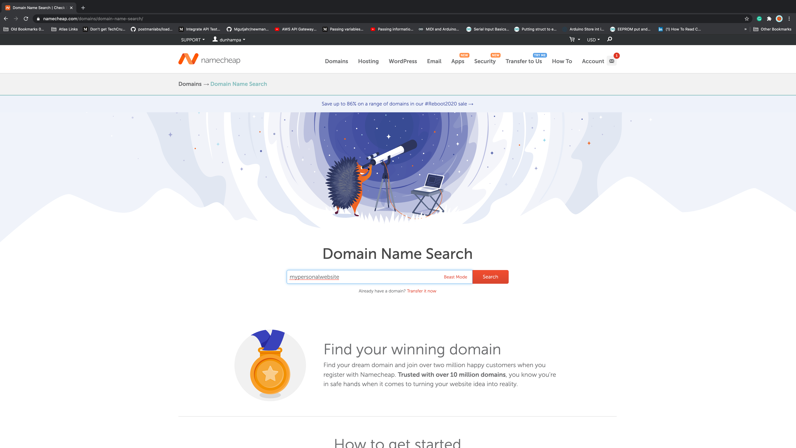

//Add a sentence or two here about what this is about

**Buying A Domain:**
1. Go to namecheap.com
2. Log-in or Create an account & then log in
3. Hover over the Domains tab at the top and click on Domain Name Search
4. In the search bar, type in the domain name you would like to use for your website (Ideally this would be something like [YourName].com)

 

5. You will be given a list of options and their respective prices
6. Select the Add to cart button the domain name you would like to use
7. When you are ready click on the the Checkout icon at the bottom right
8. Complete the Setup steps
9. Enter your billing information
10. Complete the Order

Create Your Personal Website:
Go to fullstackproblemsolvers.com and get to the fullstack-portfolio-refresh Github repo

Follow the directions in the Readme

Go back to your command Line and do a Git add -A

Do a git commit -m “Initial commit of personal website for [Insert your website name]”

Go to Github

Create a new repository

Repository name should be the same as what you named it on your local computer

Leave all the initialization options as default, and Click “create repository”

Use the “push an existing repository directions”

Now go to Netlify

Log-in or create account and then log in

New site from Git

click on the Github tab

Enter your github login info to connect netlify with your github account

Select your new repository you just created

For the build command put in hugo

For publish directory put in public

Click on Advanced

In the key put hugo_version

In the value put 0.58.3

Click on Deploy Site

Once the production deploys status changes to Published, move on to the next step

Now lets setup your custom domain

Click on add a custom domain

type in the domain name you purchased from namecheap

Click on verify

click on the options click setup Netlify DNS

Click continue

Take the IP addresses provide and go back to namecheap

under my account  and click on manage domain

Under name servers change to CUstom DNS

Add the IP address (provided by Netlify) one by one

Then go back to Nelify and click Done

Allow 24 hours to complete step 3 of securing your site with  HTTPS