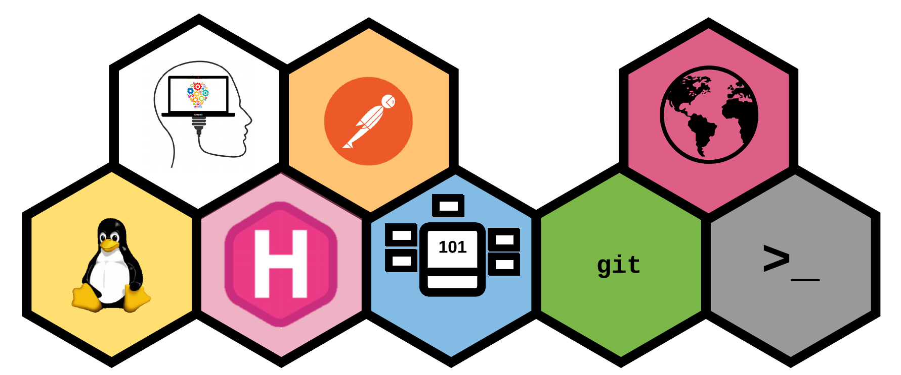

**Full Stack Problem Solving** is a self-credentialization badging system concept embodying 3 basic actions: Learn, Apply, Teach.

* *LEARN* - Learning is the first step in the process and can take many forms. Some choose to take classes, some read text books, and some hack away. Trying to choose which method can often be the most intimidating part, but the key is just being willing to take the first step! 

* *APPLY* - Knowledge is great, but only if you can use it. It is important to apply what you know, because in doing so you will unlock the ability to truly master something.

* *TEACH* - This might be the most overlooked part of problem solving. Being able to learn and apply what you know is important, but if the only person who benefits from that knowledge is you, then can you really say it makes a difference? It is this ability to take what you know and teach it to others, that can set you apart from the rest.

So the question now is, where do you start? Well, above we have a drop down  with some self-credentialization  badges that you can explore as you begin your journey towards becoming a fullstack problem solver. Each badge will provide you a summary and the criteria for how to earn each badge.

All we ask is that if you are able to use these badges, give us a shoutout! We love to see how others are growing as well as learn from what others are doing for self-credentialling!